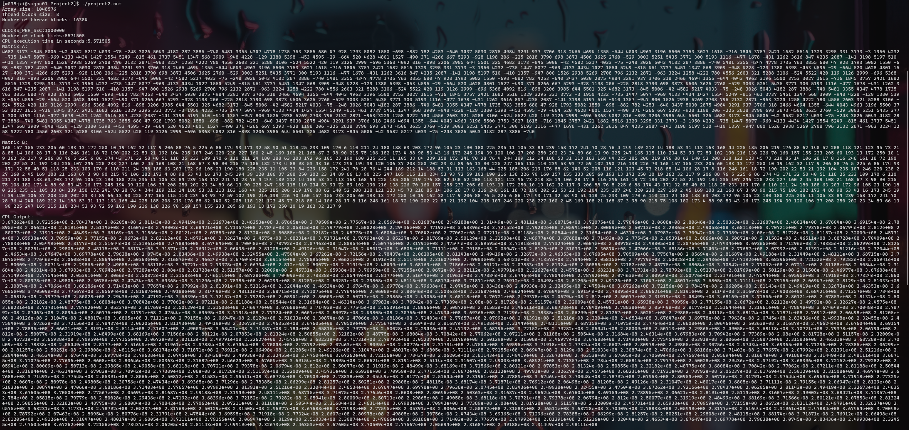
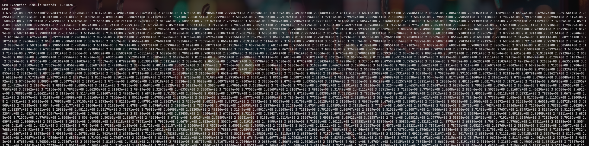

# Project 2 Report

## Report
For this lab, we were able to get our code fully functional and working. We executed the code using the command, `nvcc Project2.cu && ./a.out`. The program does both cpu multiplication and gpu tiled matrix multiplication correctly. For runtimes for the configurations and the performance differentials are listed in the table below. 

## Runtime Table

Time | 128 * 128 | 1024 * 1024 | 4096 * 4096
-----|-----------|-------------|-------------|
CPU Comp Time (s) | 0.011143 | 5.552852 | 1196.504552 |
GPU Comp Time (ms) | 0.075584 (Tile width of 8) / 0.06752 (Tile width of 16) | 6.23139 (Tile width of 8) / 5.28634 (Tile width of 16) | 388.023 (Tile width of 8) / 286.391 (Tile width of 16) / 203.53 (Tile width of 32) |
Speedup | -85% / -84% | -10% / 5% | 208% / 318%

## Output Sample Images

