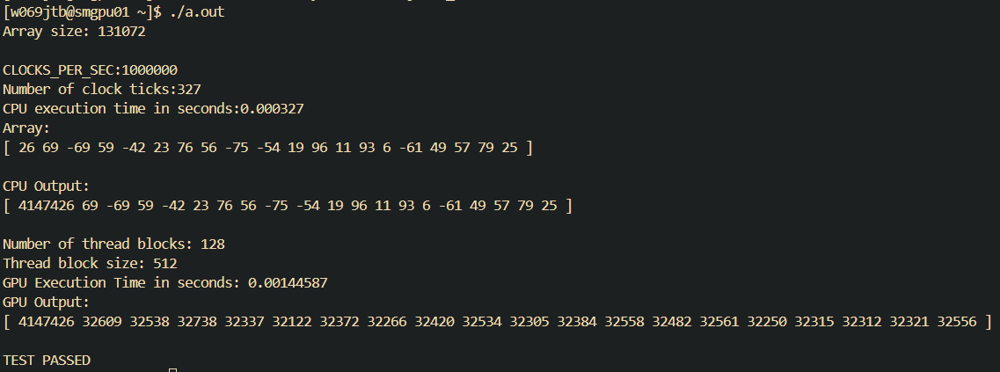
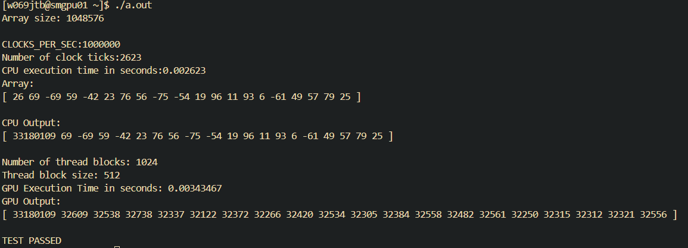
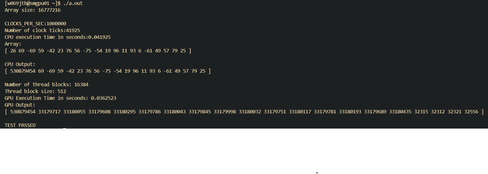

# CS 4370 - Parallel Programming
Bella Brickler, Jahcorian Ivery, Renee Paxson

Professor Meilin Liu

8 November 2024

## Project 3: Sum Reduce and Prefix Sum - Project Report

### Report
For this lab, we were able to get our code fully functional and working. We executed the code using the following commands:
`nvcc Brickler-Ivery-Paxson-Project3_Task1.cu -o Project 3_Task1 && ./Project3_Task1.out`
`nvcc Brickler-Ivery-Paxson-Project3_Task2.cu -o Project3_Task2 && ./Project3_Task2.out`

### Task 1 Runtime Table

Time | 131072  | 1048576  | 16777216
-----|-----------|-------------|-------------|
CPU Comp Time (s) | 0.000366 | 0.002610 | 0.041925 |
GPU Comp Time (s) | 0.00144587 | 0.00343467 | 0.0362523
Speedup | -75.7% | -24.0% |  115% |

### Execution Results - Task 1
131072 Length array with block size of 512

1048576 Length array with block size of 512 

16777216 Length array with block size of 512 

