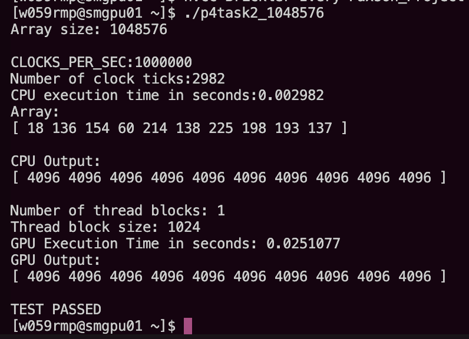

# CS 4370 - Parallel Programming
Students: Jahcorian Ivery, Bella Brickler, Renee Paxson

Class: CS 4370 - Parallel Programming for Many-core Gpus

Instructor: Meilin Liu

Date: 12/2/2024

## Project 4: Histogram

### Report 
For this lab, we were able to get our code fully functional and working. We executed the code using the following commands:

`nvcc Brickler-Ivery-Paxson_Project4_Task1.cu -o Project4_Task1 -arch=sm_30 && ./Project4_Task1`

`nvcc Brickler-Ivery-Paxson_Project4_Task2.cu -o Project4_Task2 -arch=sm_30 && ./Project4_Task12`

### Task 1 Runtime Table

Time | 131072 | 1048576 | 
----|----|----|
CPU Comp Time (s) | 0.000376 | 0.002996 |
GPU Comp Time (s) | 0.0117376 | 0.0894304 |
Speedup | -97% | -97% |

### Execution Results - Task 1
#### Array size 131072 with block size of 1024:

#### Array size 1048576 with block size of 1024: 

### Task 2 Runtime Table
Time | 131072 | 1048576 |
----|----|----|
CPU Comp Time (s) | 0.000372 | 0.002982 |
GPU Comp Time (s) | 0.00397547 | 0.0251077 |
Speedup |-91% |-88% | 
### Execution Results - Task 2
#### Array size 131072 with block size of 1024:

#### Array size 1048576 with block size of 1024:

